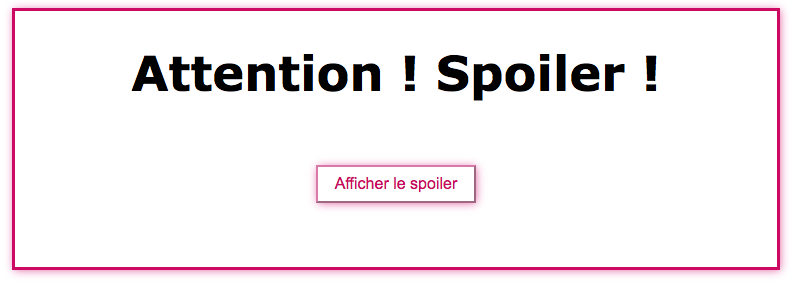

# Création d'un système de spoiler

 Pour mes premiers pas en Javascript, j'ai décidé de suivre un tuto de Grafikart que vous pourrez retrouver [ici](https://www.youtube.com/watch?v=i7kavjcIFSU). J'ai créé un système de spoiler, avec des petites animations dynamiques afin de ne pas perdre la main.
 
 

## Technologies:

* HTML
* CSS
* Javascript
